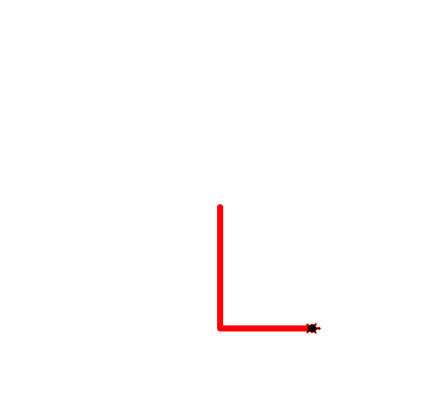

# Task

## Statement
### draw a "L" shape
		200 steps for one side and 150 steps for the other

```
FD(200)
LT(90)
FD(150)
```

## Simple loop
### draw a cirle loop
	    Circle: 50 steps in length for each edge
	    Turn 90 degrees right -> 4 circles

```
REPEAT (4, 
Circle(50),
RT(90)
)

```

## Learning into the loop and function
### Function_Loop1
		Suqare: 150 steps in length for each edge
		Turn 0 degrees right -> 4 squares

```
REPEAT (4,
	REPEAT (4,
	FD(150),
	RT(90)
	)
)
```

### Function_Loop2
		Suqare: 150 steps in length for each edge
		Turn 30 degrees right -> 6 squares

```
REPEAT (6,
	REPEAT (4,
	FD(150),
	RT(30)
	)
)
```


<!-- ### Function_Loop3
		Suqare: 150 steps in length for each edge
		Turn 45 degrees right -> 8 squares


### Function_Loop4
		Suqare: 150 steps in length for each edge
		Turn 60 degrees right -> 12 squares
 -->